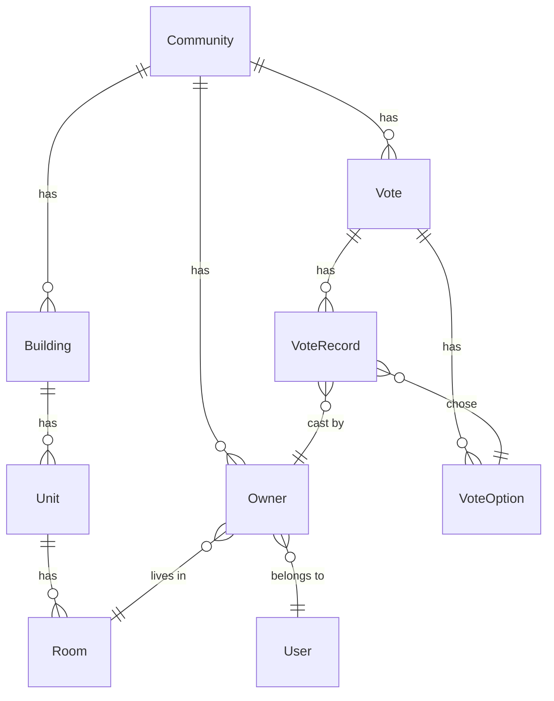

# 社区在线投票平台 — 产品需求文档（PRD）

> 本文档是项目的唯一需求源。所有功能开发、修改、测试均以本文档为基准。
> 此文件为 PRD 示例，展示一个真实项目的 PRD 应该详细到什么程度。

## 一、产品概述

### 1.1 产品定位

面向住宅小区的在线投票 SaaS 平台，解决线下投票效率低、参与率低、统计繁琐的痛点。各小区通过「入驻」方式使用统一平台，数据隔离但共享基础设施。

### 1.2 目标用户

| 用户角色 | 使用场景 | 使用端 |
|----------|----------|--------|
| 平台管理员 | 管理所有小区入驻、平台配置 | Web 管理后台 |
| 小区管理员 | 管理业主、创建投票、查看结果 | Web 管理后台 |
| 业主 | 参与投票、查看结果、认证身份 | 微信小程序 |

### 1.3 核心功能概述

1. 业主身份认证（管理员导入 / 自行注册审核）
2. 在线投票（一户一票 / 一人一票 / 按面积计票）
3. 投票结果统计与导出
4. 楼栋房号管理
5. 多小区 SaaS 隔离

---

## 二、用户角色与权限

### 2.1 角色定义

| 角色 | 权限范围 | 认证方式 |
|------|----------|----------|
| 平台管理员 | 管理所有小区、系统配置 | JWT（手机号+密码） |
| 小区管理员 | 管理本小区业主、投票 | JWT（手机号+密码） |
| 业主 | 参与投票、查看结果 | 微信 OpenID |

### 2.2 权限矩阵

| 功能模块 | 平台管理员 | 小区管理员 | 业主 |
|----------|-----------|-----------|------|
| 小区管理 | ✓ | ✗ | ✗ |
| 楼栋管理 | ✗ | ✓ | ✗ |
| 业主管理 | ✗ | ✓ | ✗ |
| 创建投票 | ✗ | ✓ | ✗ |
| 参与投票 | ✗ | ✗ | ✓ |
| 查看结果 | ✓ | ✓ | ✓ |

---

## 三、数据库设计

### 3.1 ER 图

### 3.2 核心数据表

**User 表**

| 字段 | 类型 | 约束 | 说明 |
|------|------|------|------|
| id | INT | PK, AUTO_INCREMENT | |
| phone | VARCHAR(20) | UNIQUE, NOT NULL | 手机号 |
| password_hash | VARCHAR(255) | | 管理员密码 |
| wx_openid | VARCHAR(100) | UNIQUE | 微信 OpenID |
| role | ENUM('platform_admin','community_admin','owner') | NOT NULL | |
| created_at | DATETIME | NOT NULL, DEFAULT NOW() | |

**Vote 表**

| 字段 | 类型 | 约束 | 说明 |
|------|------|------|------|
| id | INT | PK | |
| community_id | INT | FK → Community | |
| title | VARCHAR(200) | NOT NULL | 投票标题 |
| description | TEXT | | 投票说明 |
| vote_type | ENUM('single','multiple') | NOT NULL | 单选/多选 |
| vote_rule | ENUM('one_room_one_vote','one_person_one_vote','by_area') | NOT NULL | 投票规则 |
| status | ENUM('draft','scheduled','active','ended','archived') | NOT NULL | |
| start_time | DATETIME | NOT NULL | 开始时间 |
| end_time | DATETIME | NOT NULL | 结束时间 |
| created_at | DATETIME | DEFAULT NOW() | |

---

## 四、页面功能详细设计

### 4.1 A1: 登录页面（管理后台）

**页面布局：**

- 居中卡片式登录框
- 左侧品牌区域：产品 Logo + 产品名 + 一句话描述
- 右侧登录表单：手机号输入框 + 密码输入框 + 登录按钮

**用户交互：**

- 手机号输入框：11位数字校验，非法输入实时提示"请输入正确的手机号"
- 密码输入框：支持显示/隐藏切换
- 登录按钮：点击后按钮变为 loading 状态，禁止重复点击
- 登录成功：保存 JWT Token 到 localStorage，跳转到工作台
- 登录失败：在表单上方显示红色错误提示"手机号或密码错误"

**异常处理：**

- 网络异常：提示"网络连接失败，请检查网络"
- 连续5次失败：提示"登录失败次数过多，请稍后再试"

**接口依赖：**

- `POST /api/v1/auth/login` — 参数 `{ phone, password }`，返回 `{ token, user_info }`

**验收标准：**
- [ ] 手机号格式校验正确
- [ ] 登录成功后跳转到工作台
- [ ] 登录失败显示错误提示
- [ ] Token 正确保存到 localStorage

### 4.2 A2: 工作台/仪表盘（小区管理员）

**页面布局：**

- 顶部：4个统计卡片横向排列
  - 待审核数（可点击，跳转到认证审核页）
  - 本月投票数
  - 总户数
  - 已认证业主数
- 中部：最近的认证申请列表（最新5条）
- 底部：最近的投票列表（最新5条）

**数据展示：**

- 最近认证申请表格列：姓名 / 手机号 / 楼栋房号（格式：1栋2单元501）/ 申请时间 / 状态标签 / 操作
- 状态标签颜色：已认证=绿色、待审核=橙色、已驳回=红色
- 最近投票表格列：标题 / 状态 / 已投/总房号 / 参与率

**用户交互：**

- 点击"待审核数"卡片 → 跳转到 `/owners?status=pending`
- 待审核记录操作列显示"通过"/"驳回"按钮
- 点击"通过" → 直接通过认证，刷新列表
- 点击"驳回" → 弹出输入框填写驳回原因

**接口依赖：**

- `GET /api/v1/communities/{id}/dashboard` — 返回统计数据 + 最近列表

**验收标准：**
- [ ] 4个统计卡片数据正确
- [ ] 待审核数可点击跳转
- [ ] 认证申请列表展示楼栋房号
- [ ] 通过/驳回操作正常

### 4.3 投票详情页（小区管理员）

**页面布局：**

- 顶部：投票基本信息区域
  - 标题（大字）
  - 投票规则 / 起止时间 / 状态标签（横向排列）
- 中部：投票结果统计
  - 各选项得票数柱状图/进度条
  - 参与率圆形进度
  - 已投/总房号数
- 底部：投票明细表格
  - 列：楼栋房号（格式：1栋1单元101）/ 业主姓名 / 投票选项 / 投票时间
  - 支持分页
  - 底部显示"共 X 条记录"

**用户交互：**

- "导出报告 (Excel)" 按钮：导出投票明细为 Excel 文件
- 进行中的投票显示"结束投票"按钮（需二次确认）

**接口依赖：**

- `GET /api/v1/votes/{id}` — 投票详情 + 结果统计
- `GET /api/v1/votes/{id}/records?page=1&size=20` — 投票明细
- `GET /api/v1/votes/{id}/export` — 导出 Excel

**验收标准：**
- [ ] 投票信息正确展示
- [ ] 结果统计与实际投票记录一致
- [ ] 参与率计算正确（已投/总房号 * 100%）
- [ ] Excel 导出功能正常
- [ ] 明细表格分页正常

---

## 五、非功能需求

### 5.1 性能要求

- 页面首屏加载时间 < 3s
- API 响应时间 < 500ms
- 支持单小区 5000 户同时在线投票

### 5.2 安全要求

- 密码 bcrypt 加密存储
- JWT Token 有效期 24 小时
- 防 SQL 注入（使用 ORM）
- 小程序端通过微信 OpenID 认证

---

## 六、开发阶段划分

| 阶段 | 内容 | 状态 |
|------|------|------|
| Phase 1 | 基础架构搭建（项目骨架、数据库、认证、登录） | ✅ 已完成 |
| Phase 2 | 小区与业主管理（CRUD、认证、导入、楼栋管理） | ✅ 已完成 |
| Phase 3 | 核心投票功能（投票全流程、状态流转、统计导出） | ✅ 已完成 |
| Phase 4 | 完善与商业化（通知推送、签名、PDF 导出） | 🔲 待开发 |
